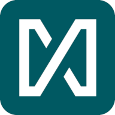

<p align="center">
  
</p>
<h1 align="center">Mnestix</h1>

[](https://xitaso.com/)
[](https://choosealicense.com/licenses/mit/)
[]()
[](https://mnestix.io/)

### Quick start (modified Mnestix code for our app)

1. **Install node, yarn, docker, docker compose**
2. **Set up backend service https://github.com/ME-IIOT/type-aas-gui-backend/tree/frontend-integration**
3. **Run dev command for latest dev update**
```
yarn docker:dev
```


### Welcome to the Mnestix Community!

Mnestix Browser is an open source software designed to simplify the implementation of the Asset Administration Shell. Together
with increasing contributions from users and developers, a growing community is working on further development under the
leadership of XITASO, a leading high-end software development company in the engineering industry.
Mnestix Browser is the perfect tool to demonstrate the power and potential of AAS (**Asset Administration Shells**) for the
implementation of standardized digital twins. It opens the way for use cases such as the Digital Product Passport (DPP).

You can find a demo [here](https://mnestix-prod.azurewebsites.net/).
Some screenshots can be found in the [screenshots folder](screenshots).

### **If you need support feel free to contact us through our website [Mnestix.io](https://mnestix.io/).**

## Getting started with Mnestix

### Development technologies

-   Next.js

### Running Mnestix Browser

Docker simplifies the development environment setup.

#### Prerequisites

Before you begin, ensure you have the following tools installed on your system:

1. **Node.js**
2. **Yarn**

3. **Docker**: Docker is required to create and run the application containers.

    - [Install Docker](https://docs.docker.com/get-docker/)

4. **Docker Compose**: Docker Compose is a tool for defining and running multi-container Docker applications.
    - [Install Docker Compose](https://docs.docker.com/compose/install/)

#### Run Mnestix as Complete AAS Application
The easiest way to get Mnestix up and running is by using the prepared development environment.
This setup includes:
- Mnestix Browser (This repository)
- Mnestix Backend
- BaSyx Repository
- BaSyx Discovery Service
- BaSyx Registry  

To start all mentioned services together with the viewer, run the following command:
```
yarn docker:dev
```
This will start the Mnestix Browser and mentioned services with a default configuration, to adapt this setup have a look at [configuration](#mnestix-configuration-settings).  
The Mnestix Browser is now running on http://localhost:3000.


#### Run Mnestix Browser Only
You can start the Mnestix Browser as standalone application as well. There is a provided docker compose file to run the Mnestix Browser out of the box. 
To do that, the environment variables in `docker-compose/compose.only-frontend.yml` should be adjusted to the available values.
You need to have at least the `AAS_REPO_API_URL` variable set to be able to view an AAS. A detailed description on how to configure the viewer can be found at the [configuration](#mnestix-configuration-settings) section.

Afterwards start the Mnestix Browser with the following command:
```
yarn docker:only-frontend
```
The Mnestix Browser is now running on http://localhost:3000.

To check what other options exist to run the Mnestix Browser, see the yarn scripts in `package.json`

#### Docker Compose files

-   **compose.yml** - runs Mnestix Browser in production environment. Production image will be build if not found in local Docker Image Cache.

    **Mnestix Browser on port 3000 - http://localhost:3000** <br>
    <br>
-   **compose.dev.yml** - runs Mnestix Browser in a development environment. A development image will be built if it is not found in the local Docker Image Cache.<br>
    **Mnestix Browser on port 3000 - http://localhost:3000** <br>
    **Mnestix Api on port 5064 - http://localhost:5064** <br>
    **AAS Repo on port 8081 - http://localhost:8081/swagger-ui/index.html** <br><br>
-   **compose.only-frontend.yml** - will start only Mnestix Browser without any additional services.
    With this setup, it is important to specify an external AAS Repository with appropriate flag settings, see frontend flags [section](#frontend-configuration).
    <br>**Mnestix Browser on port 3000 - http://localhost:3000** <br><br>
-   **compose.test.yml** - used to configure and run end-to-end (E2E) tests using Cypress. When this file is executed, it will start the necessary services for the application and execute the Cypress tests.
    If any test fails, the results and logs will be saved in a designated directory for further analysis.

All these compose files except the `only-frontend` use services specified in the `common-services.yml` file

-   **common-services.yml** - Specifies the services required to run an AAS environment with:
    -   mnestix-api - API service from the Mnestix ecosystem designed to expand Mnestix Browser functionalities,
        adding AAS List, Template Builder and allowing for the configuration of custom settings such as themes and aasId
        generation. (**On port 5054 - http://localhost:5064/swagger/index.html#/**) - mongodb - NoSql database to store data
    -   aas - service of AAS repository (BaSyx component [aas-environment](https://github.com/eclipse-basyx/basyx-java-server-sdk/tree/main/basyx.aasenvironment))


### Setup Instruction

Use the appropriate Docker Compose file based on your needs.

#### Starting containers:

Production Environment:
```sh
yarn docker:prod
```
or
```sh
docker compose -f docker-compose/compose.yml up
```
Development Environment:
```sh
yarn docker:dev
```
or
```sh
docker compose -f docker-compose/compose.dev.yml up
```
Only Mnestix Browser:
```sh
yarn docker:only-frontend
```
or
```sh
docker compose -f docker-compose/compose.only-frontend.yml up
```
E2E Testing with Cypress:
```sh
yarn docker:test
```
or
```sh
docker compose -f docker-compose/compose.test.yml up
```
- #### Stopping containers:
Specify the correct file to stop services:
```sh
docker compose -f docker-compose/compose.*.yml down
```
- #### Additional Command to view the logs for specific service:
```sh
docker compose -f docker-compose/compose.*.yml logs <service-name>
```

### Existing images in dockerhub

Our Docker images are available on Docker Hub [Mnestix Browser](https://hub.docker.com/r/mnestix/mnestix-browser) and [Mnestix Api](https://hub.docker.com/r/mnestix/mnestix-api). You can pull the images using the following commands:

#### To pull a specific version, use the version tag:

```sh
docker pull mnestix/mnestix-viewer:tag
```

```sh
docker pull mnestix/mnestix-api:latest
```

### Install Mnestix Browser from local build

Install all packages for the frontend.

```sh
yarn install
```

### Run the project

```sh
yarn dev
```

Now the Mnestix Browser will run on [http://localhost:3000/](http://localhost:3000/)

### Upload your first AAS
We provide a simple AAS in the folder **test-data** which you can use as a first test AAS.
You can upload the .aasx file to your BaSyx repository by using the upload endpoint of BaSyx (check `http://localhost:8081/swagger-ui/index.html` and search for the `/upload` endpoint to get more information).   
Afterwards, you can visit your running Mnestix Browser and search for the AAS ID `https://vws.xitaso.com/aas/mnestix` to visualize the test AAS.

## Feature Overview

The Mnestix Browser enables you to browse through the different AAS Dataspaces.
It allows you to **visualize Asset Administration Shells and their submodels**. It supports the AAS Metamodel and API in version 3.

You configure the endpoint of an AAS repository and browse the different AAS, if a Discovery Service is available, it is also possible to search for AssetIds and visualize the corresponding AAS.

Mnestix AAS Browser is also **optimized for mobile view** to have a **great user experience** on mobile phones.

Mnestix can **visualize every submodel** even if it is not standardized by IDTA. There are some submodels **visualized in a extra user friendly manner**. These are:

- Digital Nameplate
- Handover Documentation
- Carbon Footprint
- **and more!**

Moreover dedicated visualizations for submodels can be added as a further feature.

## Use Mnestix

### Personalization

It is possible to change the look and feel by setting a theme color and a personal logo when deploying the Mnestix Browser, see [here](#how-to-set-a-custom-logo).

### BaSyx API

-   Mnestix is using BaSyx, by appending /repo to our URLs, we are forwarding the requests to BaSyx via
    proxy: [BaSyx AAS API Collection](https://app.swaggerhub.com/apis/Plattform_i40/Entire-API-Collection/V3.0#/Asset%20Administration%20Shell%20Repository%20API/GetAssetAdministrationShellById)
-   With this, BaSyx endpoints can be reached through Mnestix.
    -   AAS Repository Api: http://localhost:3000/repo/shells/{YourAasIdInBase64}
    -   Submodel Repository Api: http://localhost:3000/repo/submodels/{YourAasIdInBase64}
    -   The BaSyx Swagger UI gives a detailed overview of all available
        endpoints: http://localhost:8081/swagger-ui/index.html

## Mnestix Configuration Settings


### Frontend Configuration

Mnestix provides the following configuration options. You can adapt the values in your docker compose file.

| Name                                  | Default value           | Description                                                                                                                                                                                  | required |
|---------------------------------------|-------------------------|----------------------------------------------------------------------------------------------------------------------------------------------------------------------------------------------|----------|
| `DISCOVERY_API_URL`                   |                         | Address of the Discovery Service to find an AAS for an Asset                                                                                                                                 | required |
| `REGISTRY_API_URL`                    |                         | Address of the AAS Registry Service to retrieve the related descriptor for an AAS                                                                                                            | optional |
| `AAS_REPO_API_URL`                    |                         | Default AAS Repository to display when AAS Id is not in AAS Registry                                                                                                                         | required |
| `MNESTIX_BACKEND_API_URL`             |                         | Mnestix Backend with a lot of business comfort features like the Repository-Proxy or the Template builder                                                                                    | optional |
| `AAS_LIST_FEATURE_FLAG`               | false                   | Enables or disables the AasList in the frontend. This only works in combination with `Features__AllowRetrievingAllShellsAndSubmodels` being set to `true` (Needs the Mnestix Backend to work) | optional |
| `AUTHENTICATION_FEATURE_FLAG`         | false                   | Enable or disable the authentication in the frontend. (Needs the Mnestix Backend to work)                                                                                                     | optional |
| `COMPARISON_FEATURE_FLAG`             | false                   | Enables or disables the comparison feature.                                                                                                                                                   | optional |
| `LOCK_TIMESERIES_PERIOD_FEATURE_FLAG` | false                   | Enables or disables the selection of the timerange in the TimeSeries submodel.                                                                                                                | optional |
| `THEME_PRIMARY_COLOR`                 | Mnestix Primary Color   | Changes the primary color of Mnestix Browser, e.g. #00ff00. The following formats are supported: #nnn, #nnnnnn, rgb(), rgba(), hsl(), hsla(), color()                                          | optional |
| `THEME_SECONDARY_COLOR`               | Mnestix Secondary Color | Changes the secondary color of Mnestix Browser, e.g. #0d2. The following formats are supported: #nnn, #nnnnnn, rgb(), rgba(), hsl(), hsla(), color()                                           | optional |
| `THEME_LOGO_MIME_TYPE`                |                         | Used in parsing the logo mounted `-v /path/to/logo:/app/public/logo` the mime type is needed, e.g. `image/svg+xml`, `image/png`, `image/jpg`                                                  | optional |
| `THEME_LOGO_URL`                      |                         | This variable **overwrites** the Logo in the theme, and thus the environment variable `THEME_LOGO_MIME_TYPE` will not be evaluated and it is not necessary to mount the image as specified below | optional |

#### How to set a custom logo

There are multiple ways to set a logo, you can either use Option 1 or Option 2:

##### Option 1
First you need to mount your logo to the container, e.g. by adding it to the docker compose file
```yaml
    environment:
      - THEME_LOGO_MIME_TYPE: 'image/svg+xml'
...
    volumes:
      - /path/to/my/logo.svg:/app/public/logo
```


When using the provided [`compose.yaml` File](docker-compose/compose.yml) you can just replace the [image in the `data` folder](docker-compose/data/logo.svg) with your preferred logo.

Remember to set the mime type correctly in order for the browser to parse your image correctly.
Only image mime types are allowed.
https://developer.mozilla.org/en-US/docs/Web/HTTP/Basics_of_HTTP/MIME_types/Common_types


##### Option 2
This version overwrites the previous settings, you can either use one or the other.
To use this just set an environment variable to a link hosted that is publicly accessible:
```yaml
...
    environment:
      THEME_LOGO_URL: https://xitaso.com/wp-content/uploads/XITASO-Logo-quer.svg
```

#### Using Azure Entra ID
> **Note:** If the login functionality is going to be used, then apart from setting the authentication flag to `true`, `AD_CLIENT_ID` and `AD_TENANT_ID` should be set by copying `.env.example` to your own `.env` and specifying this sensitive information there.

The `.env` file should look like this:

```plaintex
AD_CLIENT_ID: '<<Azure client ID>>'
AD_TENANT_ID: '<<Azure tenant ID>>'
MNESTIX_BACKEND_API_KEY: '<<YOUR_API_KEY>>'
```
#### Using the Mnestix Backend
It is possible to have the other needed systems running like the Mnestix Api so we can have full functionality out of the Mnestix Browser, to do that we can use the provided `docker-compose/compose.dev.yml` by also adjusting the env variables there.

as an extra step it is also necessary to set `MNESTIX_BACKEND_API_KEY` in `.env` to be able to secure all Mnestix Api endpoints, with the exception of the AasList endpoint.

```plaintex
MNESTIX_BACKEND_API_KEY: '<<YOUR_API_KEY>>'
```

> **Note:** Please replace `<<YOUR_API_KEY>>` with your actual API key immediately to ensure proper functionality and security.


### Retrieval of AAS and Submodels?
#### Concept
The **Discovery Service** enables Mnestix to find all AASs that belong to one Asset.
We are standard conform but recommend the usage of the [BaSyx Implementation of the Discovery Service](https://github.com/eclipse-basyx/basyx-java-server-sdk/tree/main/basyx.aasdiscoveryservice).

The **AAS Registry** is designed to retrieve AAS Descriptors that contain the endpoint for the **Asset Administration Shell (AAS) Interface**.

[](https://industrialdigitaltwin.org/wp-content/uploads/2023/07/2023-07-27_IDTA_Tutorial_V3.0-Specification-AAS-Part-2_API.pdf)\
(Source: [IDTA](https://industrialdigitaltwin.org/wp-content/uploads/2023/07/2023-07-27_IDTA_Tutorial_V3.0-Specification-AAS-Part-2_API.pdf))

A tutorial about the Discovery Service along with the registries can be found [on the IDTA website](https://industrialdigitaltwin.org/wp-content/uploads/2023/07/2023-07-27_IDTA_Tutorial_V3.0-Specification-AAS-Part-2_API.pdf).

### How to connect Mnestix Browser to the different components

#### Running Mnestix with its API

There also exists the [Mnestix API](https://hub.docker.com/r/mnestix/mnestix-api), that provides different business comfort features.
Here it is possible to set an API Key, for example, to secure your backend services like the repository or the discovery service.
When running the [Mnestix API](https://hub.docker.com/r/mnestix/mnestix-api) you can change the paths to the different services like described in the [Mnestix API Documentation](https://hub.docker.com/r/mnestix/mnestix-api).
For example (change `{{MNESTIX_BACKEND_API_URL}}` to the URL of the running [Mnestix API](https://hub.docker.com/r/mnestix/mnestix-api))
```yaml
      DISCOVERY_API_URL: '{{MNESTIX_BACKEND_API_URL}}/discovery'
      AAS_REPO_API_URL: '{{MNESTIX_BACKEND_API_URL}}/repo'
      MNESTIX_BACKEND_API_URL: '{{MNESTIX_BACKEND_API_URL}}'
```

#### Running Mnestix without its API

This is the easiest configuration, for when you only want to visualize and browse through AAS.
If you choose to run the Mnestix Browser without the Mnestix API, the Feature Flags `AUTHENTICATION_FEATURE_FLAG`
and `AAS_LIST_FEATURE_FLAG` will be overwritten to `false` as these Features use the functionality of the API.
The other environment variables should be configured [as described](#frontend-configuration).

#### How to configure the BaSyx AAS Repository

We recommend the usage of Mnestix together with the [BaSyx AAS Repository](https://github.com/eclipse-basyx/basyx-java-server-sdk).
This component stores all the different AAS (type 2), it is recommended to configure it to use a database for persistence.
We recommend to set the following environment variables (replace `{{MNESTIX VIEWER URL}}, {{MNESTIX API URL}}` with the corresponding values):
```yaml
      # Allow to upload bigger AASX files
      SPRING_SERVLET_MULTIPART_MAX_FILE_SIZE: 100000KB
      SPRING_SERVLET_MULTIPART_MAX_REQUEST_SIZE: 100000KB
      # Allow mnestix frontend and backend to call basyx
      BASYX_CORS_ALLOWED-ORIGINS: '{{MNESTIX VIEWER URL}}, {{MNESTIX API URL}}'
      BASYX_CORS_ALLOWED-METHODS: GET,POST,PATCH,DELETE,PUT,OPTIONS,HEAD
```
If you are using the Mnestix API see [here](#running-mnestix-with-its-api) on how to set the Frontend Flags.
If you are using only the Mnestix Browser just set the environment variable `AAS_REPO_API_URL` accordingly. 

#### How to configure the BaSyx Discovery Service

We recommend the usage of Mnestix together with the [BaSyx AAS Discovery Service](https://github.com/eclipse-basyx/basyx-java-server-sdk/tree/main/basyx.aasdiscoveryservice).
This component links Asset IDs to AAS IDs. It is recommended to configure it to use a database for persistence.
We recommend to set the following environment variables (replace `{{MNESTIX VIEWER URL}}, {{MNESTIX API URL}}` with the corresponding values):
```yaml
      # Allow mnestix frontend and backend to call discovery service
      BASYX_CORS_ALLOWED-ORIGINS: '{{MNESTIX VIEWER URL}}, {{MNESTIX API URL}}'
      BASYX_CORS_ALLOWED-METHODS: GET,POST,PATCH,DELETE,PUT,OPTIONS,HEAD
```
If you are using the Mnestix API see [here](#running-mnestix-with-its-api) on how to set the Frontend Flags.
If you are using only the Mnestix Browser just set the environment variable `DISCOVERY_API_URL` accordingly.

#### Technical Information - Discovery Service

The functions that are described in the [Specification AAS - Part 2: API](https://industrialdigitaltwin.org/wp-content/uploads/2023/06/IDTA-01002-3-0_SpecificationAssetAdministrationShell_Part2_API_.pdf) were implemented in the [`discoveryServiceApi.ts`](src/lib/api/discovery-service-api/discoveryServiceApi.ts).
They make the respective `GET`, `POST` and `DELETE` requests to the specified `DISCOVERY_API_URL`.
Two additional functions were added that simplify the usage of the Discovery Service by just requiring the globalAssetId and no additional AssetLinks.

These functions are `LinkAasIdAndAssetId(aasId: string, assetId: string)` and `GetAasIdsByAssetId(assetId: string)`.
The return of all functions is the response from the Discovery Service parsed as an object.
So they can be used like in the example below:

```typescript
await LinkAasIdAndAssetId(aasId, assetId);
const foundAasIds = (await discoveryServiceClient.GetAasIdsByAssetId(assetId)).result
```

#### How to configure the BaSyx AAS Registry Service

The AAS Registry Service is designed to provide descriptors for Asset Administration Shells (AAS), 
including endpoints to various repositories that may be stored elsewhere. 
This architecture ensures support for multiple repositories, provided they are registered in the designated AAS registry.

When an AAS for the specified AAS-Id is found, it is displayed in the detail view. If the AAS is not found, 
the service will search in the local repository for the requested information.

If the discovery service is configured, it will initially identify the relevant AAS-ID for the searched Asset Id before querying the Registry Service. 
Configuration of the Registry Service is optional. If the AAS Registry Service is not configured, the search will default to the local repository.

To configure the AAS repository, please provide the URL in the Frontend Configuration variables.
```yaml
REGISTRY_API_URL: '{{REGISTRY-SERVICE-URL}}'
```
By setting the REGISTRY_API_URL, you enable the AAS Registry Service, ensuring efficient retrieval of AAS descriptors.

#### Technical Information - Registry Service

The functions that are described in the [Specification AAS - Part 2: API](https://industrialdigitaltwin.org/wp-content/uploads/2023/06/IDTA-01002-3-0_SpecificationAssetAdministrationShell_Part2_API_.pdf) were implemented in the [`registryServiceApi.ts`](src/lib/api/registry-service-api/registryServiceApi.ts).
They make the respective `GET`, `POST` and `DELETE` requests to the specified `REGISTRY_API_URL`.

### Different Mnestix Configurations

There are multiple scenarios possible on how to deploy the Mnestix Browser with different configurations.
In the following, it is described, what scenarios were thought of and how to configure them

#### I want to only view AAS

If you just want to view AAS and integrate it into your existing environment, you can run only the `mnestix-viewer` without its API.
See [Running Mnestix without its API](#Running-Mnestix-without-its-API).

#### I want to use more advanced features

There are also some more advanced features one might want to use.
For this you need to enable the Mnestix API, see [here](#running-mnestix-with-its-api).
It enables you to secure all `POST/PATCH/DELETE`-Request with an API-Key.
The API-Key needs to be sent within the Header `ApiKey` to make those requests.
Normal `GET/FETCH`-Requests are not affected by this.

When using it is also possible to restrict some functions that you possibly don't want to be accessible.
For example, it is possible to restrict the access to the `/shells` endpoint of the AAS repository by setting the backend environment variable `Features__AllowRetrievingAllShellsAndSubmodels: false`.
Remember that this also means that the functionality to list all AAS won't work anymore in the Mnestix Browser, so disable this functionality with the environment variable `AAS_LIST_FEATURE_FLAG: false`.

One can also add an AzureAD Service to give people deeper access, this enables the "Login" Button in the Mnestix Browser.
After logging in, users have access to even more functionality.
To see how to connect to an Azure Tenant and enable the login functionality see the [official Mnestix API documentation](https://hub.docker.com/r/mnestix/mnestix-api).

#### I want to create multiple AAS

This option builds upon the advanced features described in the [previous section](#i-want-to-use-more-advanced-features).
After logging in it is possible to configure the ID Generation Functionality of the backend.
Here it is possible to automatically generate AAS using only a short ID of the Asset.
How the AAS Creator in conjunction with the ID Generations Functionality works can be seen in the [official Mnestix API documentation](https://hub.docker.com/r/mnestix/mnestix-api).

One can also use the Template Builder with the Data Ingest Endpoint to send arbitrary JSON files to the API and automatically add them to a specified AAS.
This enables easy integration into exisiting ETL processes.
How exactly this works can be seen in the [official Mnestix API documentation](https://hub.docker.com/r/mnestix/mnestix-api).

Below you'll find a small overview on how the components interact with each other:


## Maintaining

### Setting up VSCode

#### Extensions

See `.vscode/extensions.json` for a list of recommended extensions.
VSCode will suggest to install them when opening the project.

#### Settings

See `.vscode/settings.json` for defined workspace settings.

### Setting up Rider

Check the configurations for Rider under `.idea/` folder

### Installing and adding/removing frontend packages

### Formatting & Linting

We use Prettier and ESLint to keep our frontend code clean. Having a ESLint warning **will break the pipeline**. It's
therefore always a good idea to run `yarn format` and `yarn lint` before you commit.

#### Run prettier check

```sh
yarn prettier
```

#### Run prettier (be aware, this changes files!)

```sh
yarn format
```

#### Check your code for formatting issues

```sh
yarn lint
```

If you want specific files or folders to be excluded from linting (e.g. generated files), you can add them
to `.eslintignore` and `.prettierignore`

### Cypress Testing

We use Cypress for End-to-End-Testing. In order to navigate to the right folder and run Cypress you can use the
following command. In order to use cypress testing `yarn start` must be running.

#### Open the cypress application

```sh
yarn test
```

#### Run cypress headlessly (runs all tests inside the integration folder)

```sh
yarn test:headless
```

Cypress will put videos and screenshots of the tests inside the cypress folder.

In order to run your own E2E-Tests you can put your test files in `/cypress/e2e`.

In the `fixtures` folder you can put data to use in your E2E-Tests as json files.

If you have commands you want to use in multiple tests you can put them into the `commands.ts` file inside
the `support` folder.
Don't forget to write the method header of your custom commands inside the `e2e.ts` file as well. This way the IDE
will stop marking your custom commands as wrong.

### Reverse Proxy Configuration

The YARP proxy route `/repo/shells` now limits resource and list returns to 104 elements due to the lack of pagination
support.
This change aims to prevent server overload and ensure smoother navigation through resource lists.

## Contributing

Right now we are building a community around Mnestix. We would be more than happy to have you onboard, so feel
free to contact us [mnestix@xitaso.com](mailto:mnestix@xitaso.com).

